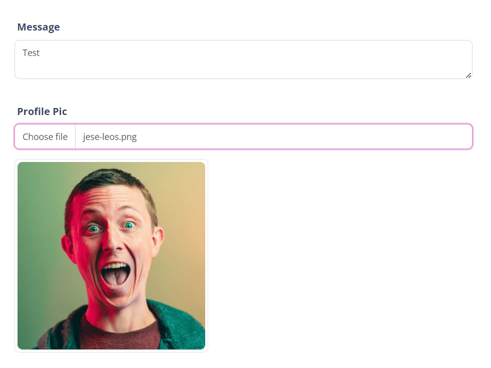

# File Upload Previews

When a User uploads a File as part of a Form, you can automatically show previews of the images it uploads.

## Introduction

When a User uploads a File as part of a [Form](https://help.siteglide.com/article/99-forms-getting-started), you can automatically show previews of the images it uploads.

We've aimed for maximum flexibility- you create the preview element with any HTML structure you like. Set the correct HTML attributes and we'll use your element to display an image preview as soon as one is available.



## Syntax

In these examples, we have a Form with a single upload field. In these examples the field's ID in the database is `form_field_11_1`.

```html
<div class="input-group"> 
    <label for="form_field_11_1">File</label>
    <input 
        class="form-control" 
        name="{{ form_builder.fields.properties.form_field_11_1.name }}"  
        type="hidden"
    />
    <input 
        class="form-control" 
        id="form_field_11_1_file" 
        type="file"
    /> 
</div>
```

The upload field already consists of the following:

* A label element (optional)
* A type="file" input which is used by the User to select their file
* A hidden input which uploads the CDN URL of the file to the database once it has been added to S3 successfully.

If you wish to add a File Preview, you'll need to add a further element. This can be any element you like, but you'll need to add a data attribute: `data-file-preview="form_field_11_1_file"` ...where `form_field_11_1_file` is the ID of your `type="file"` element.

### Images

If the File is an image, we'll either:

* If the element with the attribute is an `` tag, set the `src` attribute to display the preview image
* If the element with the attribute is not an `` tag we'll change the CSS to apply the preview image as a background image.

We'll also give you some feedback on what kind of file type the Image is by setting the `data-preview-file-type` attribute on the preview element. In itself, this has no functionality, but it allows you to set up custom CSS rules depending on the file type.

You can set the CSS of your element in advance so that the image displays in a manner of your choosing. See recommended CSS below.

### _Standard Images_

Here's an example `img` preview element:

``

Full code for this input:

```html
<div class="input-group">
  <label for="form_field_11_1">File</label>
  <input
    class="form-control"
    name="{{ form_builder.fields.properties.form_field_11_1.name }}"
    type="hidden"
  />
  <input
    class="form-control"
    id="form_field_11_1_file"
    type="file"
  />
  
</div>
```

### Background Images

Here's an example `<div>` element designed to use `background-image` to display the preview:

`<div data-file-preview="form_field_11_1_file"></div>`

Full code for this input:

```html
<div class="input-group">
  <label for="form_field_11_1">File</label>
  <input
    class="form-control"
    name="{{ form_builder.fields.properties.form_field_11_1.name }}"
    type="hidden"
  />
  <input
    class="form-control"
    id="form_field_11_1_file"
    type="file"
  />
  <div data-file-preview="form_field_11_1_file"></div>
</div>
```

### Other File Types

With a file input, you can't be certain that an image will be uploaded. We'll check this for you by inspecting the MIME type of the file. We won't attempt to display an image preview if the MIME type is not an image.

We will however, still set the `data-preview-file-type` attribute to the value of the file's file type. You will then be able to use custom CSS to display different Icons for different common file types if you choose.

For example:

```html
<style>
    [data-preview-file-type=application/pdf] {
        //set CSS rules for PDF File preview here 
    }
</style>
```

### CSS

### Recommended CSS

When using this feature, we'd recommend you set up your CSS before you start.

Remember, an empty element will have a height of 0, even if it has a `background` set in CSS, so we'd recommend you set a height to any elements which will display the preview image as a background image.

You may wish to set other CSS relating to the `background` property: [https://www.w3schools.com/cssref/css3\_pr\_background.asp](https://www.w3schools.com/cssref/css3\_pr\_background.asp)

For example:

```css
background-size: cover;
background-position: center center;
background-repeat: no-repeat;
height: 100px;
```

### Useful Selectors

As we use data-attributes extensively in this feature, you may also find it helpful to target these attributes.

For example, the following selector will target all of your File Preview elements: `[data-file-preview] {    }`

The following will target all of your File Preview elements which have a File uploaded to them: `[data-file-preview][data-preview-file-type] { }`

The following will target all of your File Preview elements which have an image uploaded to them: `[data-file-preview][data-preview-file-type|=image] { }`

The following will target all of your File Preview elements which have a File which is not an image uploaded to them: `[data-file-preview][data-preview-file-type]:not([data-preview-file-type|=image]) { }`