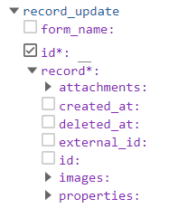
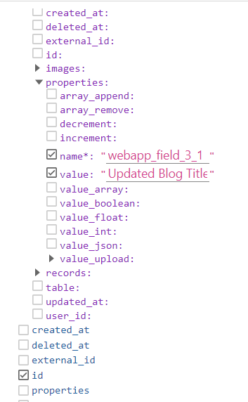
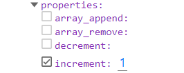

# Introduction

Last time we looked at how you can use mutations to create a record.

This time, we will look at a mutation to update a single record.

The syntax is very similar to creating a record, but the main differences are:

1\) using a different mutation type

2\) We need to pass in an ID- to identify the record which needs to be changed.

# Steps to Edit a Record

## Step 1) Add the mutation keyword

All queries started with the `query` keyword; mutations start with the `mutation `keyword.&#x20;

```graphql
mutation editItem {

}
```

We've also named our mutation `editItem`.

## &#x20;Step 2) Add the recordUpdate mutation type

```graphql
mutation editItem {
  record_update() {
  
  }
}
```



### Step 3) Add the ID of the Record which should be updated

In this example, we'll add the ID as a variable:


```graphql
mutation editItem($id: ID!) {
  record_update(id: $id, record: {})
}
```

Note, we don't need to add an object for the ID as we might when filtering a query.

## Step 4) Define the new Properties in the Record Object

As with `record_create `mutations, the `record` object defines the properties the record will have after the mutation has run.&#x20;

Any properties you set will be updated. Any properties you omit will stay in their current state.

```graphql
mutation MyMutation($id: ID!) {
  record_update(
    id: $id
    record: {
      properties: [
        {
          name: "module_field_3_1",
          value: "Updated Blog Title"
        }
      ]
    }
  )
}

```

You do not need to specify a table. By default, the record will remain in its current table. Attempting to change the table may not be supported on Siteglide as the new table would not have compatible fields.

As in our last tutorial, it is possible to pass in properties as a single large JSON variable, if you see a convenience in doing so.

## Step 5) Add Results

As in the last tutorial, it is required to add something to the object which returns with the results of the mutation. This can be useful to confirm results and show you what has changed. However, if you don't need many details, the best performing option is just to ask for `id`.



```graphql
mutation MyMutation($id: ID!) {
  record_update(
    id: $id
    record: {
      properties: [
        {
          name: "module_field_3_1",
          value: "Updated Blog Title"
        }
      ]
    }
  ) {
    id
  }
}

```

A successful mutation result will look like this:

```graphql
{
  "data": {
    "record_update": {
      "id": "96"
    }
  }
}
```

# Handling Race Conditions

Imagine you have two different forms, each with an automation attached to them and you want to count how many times the automation runs.&#x20;

You set up a WebApp with a custom integer field. Each time the automation runs, you:

1.  query the WebApp, get the current count

2.  add `1` to the value with the `add `Liquid filter and

3.  update the count with a `record_update` mutation.&#x20;

9 times out of 10, this will behave as expected, but what if two people submit the form at the same time?&#x20;

If both automations check the current count at the same time, they will both read the same value e.g. 5 and after adding 5, will save 6 as the updated count in the database. Even though the automation ran twice, the count would only increase by 1.

It is to combat this scenario that `record_update` contains the following special operations:



1.  array\_append will push the provided value to the end of an existing array stored in a property.

2.  array\_remove will remove the provided value from an existing array stored in a property, (wherever in the array it currently is)

3.  decrement will reduce an existing integer value by the provided integer value (could be 1 or some other integer)

4.  increment will increase an existing integer value by the provided integer value (could be 1 or some other integer)

In our example, we could do the following:

```graphql
mutation MyMutation($id: ID!) {
  record_update(
    id: $id
    record: {
      properties: [
        {
          name: "webapp_field_1_1",
          increment: 1
        }
      ]
    }
  ) {
    id
  }
}
```

This safely increases the counter by one per mutation run, even if the two mutations are triggered by Liquid simultaneously. There is no need to query the existing value.&#x20;

# Summary

Nice work following through this tutorial.

If you want to try updating users, you can experiement with the `user_update` mutation.

# Next Time

Next time, we'll look at how to delete records.